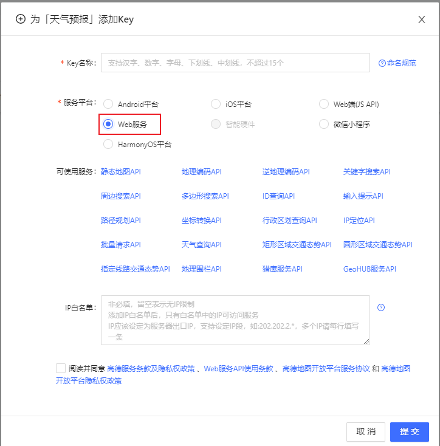
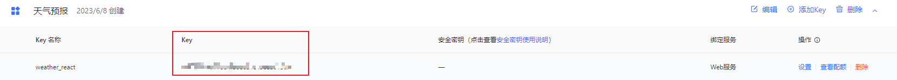
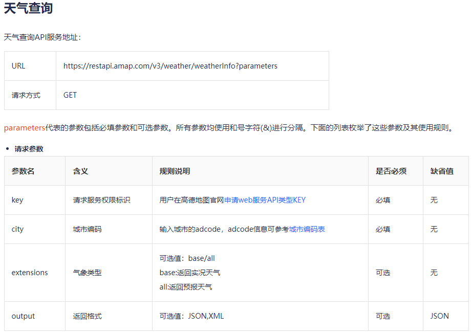
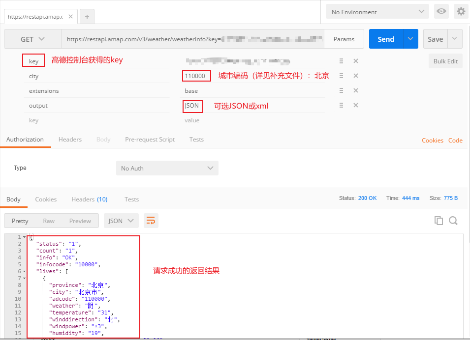
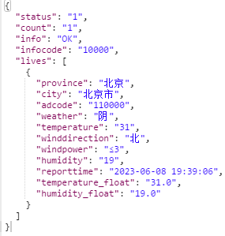
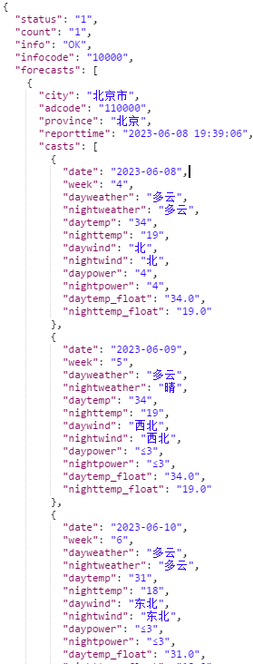
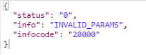
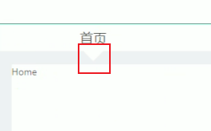

## 一、天气API——高德

使用步骤：

1. 注册高德开放平台，并切换到控制台界面：
`https://lbs.amap.com/api/webservice/guide/api/ipconfig`

2. 获取 key （高德平台的请求服务权限标识）：

    (1). 在应用管理中创建新应用，并设置名称和类型

    (2). 点击 “添加Key” 选择 Web服务：

    

    

3. 用 postman 测试API

    根据高德上给出的的请求地址和请求参数，进行接口测试：

    

    

    

    

    

## 二、a 标签添加 onClick

问题描述：

`<a href="javascript" onClick={this.logOut}>退出</a>`

点击“退出”，页面出现了闪屏，功能不能正常实现，可能是因为链接进行了跳转但是却没有指定链接直接进行了刷新。

问题解决：

1. `<a href="#" onClick={this.logOut}>退出</a>`

2. 封装一个外形像链接的按钮 **LinkButton**，为其设置样式：

``` jsx
export default function LinkButton(props) {
  return (
    <button {...props} className='link-button'></button>
  )
}
// {... props}  用于将prop里的属性全部拆开，分别使用
```

## 三、静态页面样式——小三角



具体实现：利用四个方法的 boder ，只显示一个方向，其余均设置为透明：

```css
.header .header-bottom .header-bottom-left::after {
  content: '';
  position: absolute;
  right: 50%;
  top: 150%;
  transform: translateX(50%);
  border-top: 10px solid white;
  border-left: 10px solid transparent;
  border-bottom: 10px solid transparent;
  border-right: 10px solid transparent;
}
```

## 四、useEffect 的使用（！！！）

涉及到以下功能的实现：

* “ 欢迎您，admin ”
  
  用户名称从内存（memoryUtils）中读取，根据不同用户登录显示不同的用户名称。

* “ 退出 ”

  使用了 antd5 的 Modal 组件，可以弹出对话框，点击 “ 确定 ” 会清空内存和 local 中的 user 信息，并跳转到 login 页面。使用了 `useNavigate` 实现路由的跳转。

  > ？有个小问题：设置了 replace 为 true 但是页面跳转后还是可以进行回退。

* “ 2023-6-12 15:52:45 阴 ”
  
  调用接口，请求数据，并进行展示，可以用一个函数进行封装：

    时间：用一个定时器，每秒更新一下，从组件一挂载就开启定时器，组件卸载就清除定时器，用封装好的函数对当前时间 `Date.now()` 进行格式化。并将该部分调用写在 useEffect 中。

    天气：利用高德地图提供的 API

* “ 首页 ”

  根据左侧导航栏选中的选项不同，显示不同的名称

  > ？有个小问题：可以实现不同页面显示不同的名称，但是只能页面最初打开的那一次