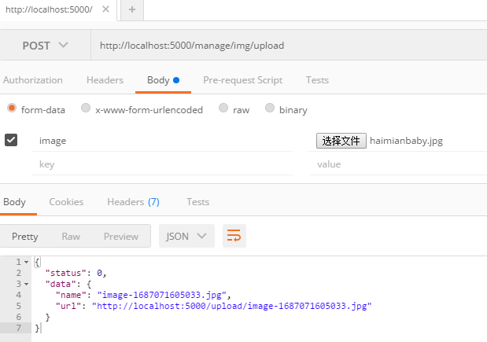
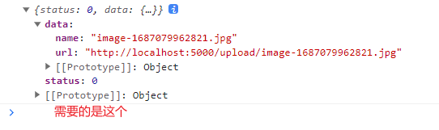
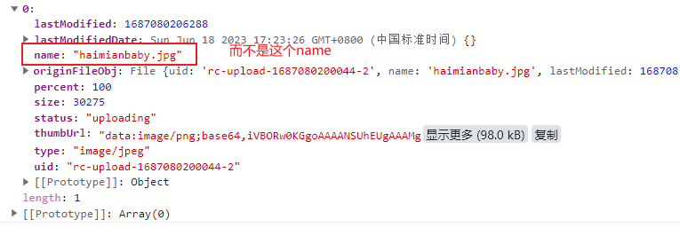

## 一、路由匹配问题

Product 中嵌套其他路由，url 中进行切换，不显示路由跳转

## 二、编程式路由导航

点击按钮实现路由跳转，函数式组件中可以使用 useNavigate。首先定义：`const navigate = useNavigate()`

则可以使用 navigate 这个函数代替：`this.history.push`、`this.history.replace`、`this.history.gofoward`、`this.history.goback`、`this.history.go`

```jsx
//push跳转 以params参数为例，navigate默认开启push模式
    const pushShow = (id, title) => {
        navigate(`/home/message/detail/${id}/${title}`)
    }

    //replace跳转 以params参数为例，开启replace：true
    const replaceShow = (id, title) => {
        navigate(`/home/message/detail/${id}/${title}`, { replace: true })
    }

    //前进
    const forward = () => {
        navigate(1)
    }
    //前进
    const back = () => {
        navigate(-1)
    }
    //go
    //前进
    const go = () => {
        navigate(2)
    }
```

## 三、组件通信方式总结

#### 组件间的关系：

- 父子组件
- 兄弟组件（非嵌套组件）
- 祖孙组件（跨级组件）

#### 几种通信方式：

    1.props：
        (1).children props
        (2).render props
    2.消息订阅-发布：
        pubs-sub、event等等
    3.集中式管理：
        redux、dva等等
    4.conText:
        生产者-消费者模式

#### 比较好的搭配方式：
    父子组件：props
    兄弟组件：消息订阅-发布、集中式管理
    祖孙组件(跨级组件)：消息订阅-发布、集中式管理、conText(开发用的少，封装插件用的多)

## 四、Product 界面下的子路由展示时，leftNav 高亮

antd 中 `<Menu/>` 组件利用 `selectedKeys` 属性来根据当前路由路径显示相应的高亮路由链接。
Product 界面里的所有子路由显示的都应该是 Product 的高亮路有链接。
```jsx
// Product界面子路由，高亮显示
  if(path.indexOf('/product')===0){
    path='/product'
  }
```
同理，子列表的自动展开也是使用同样的方法，利用属性`defaultOpenKeys`：
```jsx
let openKey = ''
if (path.indexOf('/charts') != -1) openKey = 'charts'
if (path.indexOf('/category') != -1 || path.indexOf('/product') != -1) openKey = 'goods'
```

## 五、默认显示一级和二级分类

没有接口数据，该功能没有实现。具体可根据可用的接口数据的返回格式，以及 antd 中级联选择器组件 `<Cascader/>` 的具体使用方法来实现。

## 六、图片上传

需要一个上传图片的接口（可以用尚硅谷的那个接口：http://localhost:5000/manage/img/upload ），写在`<Upload/>`组件的`action`属性中



**注意！！！**

最后需要的是服务器响应后传回来的`name`和`url`，而不是上传时图片的name和url：





因此，要在图片上传成功的时候，在`onChange()`中修改`name`和`url`：

```jsx
const getItem = () => {
    console.log("Name",fileList.map(file => file.name));  
     // name:['image-1687081053955.jpg']
  }
const onChange = ({ fileList: newFileList, file }) => {
if (file.status === 'done') {
    const result = file.response  // {status:0, data:{name:'xx.jpg', url:'图片地址'}}
    if (result.status === 0) {
    const { name, url } = result.data
    file = fileList[fileList.length - 1]
    file.name = name
    file.url = url
    message.success('图片上传成功!')
    } else {
    message.error('图片上传失败!')
    }
}
setFileList(newFileList);
};
```
### Parent 组件调用 Child 组件方法
`父<Categoru/>` 调用 `子<PicturesWall/>` 的 `getItem()`：
在父组件中通过 ref 得到子组件标签对象（也就是组件对象），调用其方法，但是函数式组件中没有this指向，没有实例，也就不能在组件上使用 ref。
使用 `forwardRef()` 和 `useImperativeHandle()`：
`forwardRef()` 会创建一个React组件，这个组件能够将其接受的 `ref` 属性转发到其组件树下的另一个组件中。
1. 在父组件中使用 `useRef()` 为 `<PicturesWall/>` 创建一个 `ref`
```jsx
function Category() {
  const picRef = useRef(null)
  return (
    <Card>
        <Form>
            <Modal>
                <PicturesWall ref={picRef} />
            </Modal>
        </Form>
    </Card>
  )}
export default Category
```
2. 在子组件中使用 `forwardRef()` 接受渲染函数作为参数。React 将使用 props 和 ref 作为参数来调用此函数。此函数应返回 React 节点。

```jsx
const PicturesWall = forwardRef((props, ref) => {  
    //用于获取已经上传的图片的name和url
  const getItem = () => {
    return fileList.map(file => file.name)  // name:['image-1687081053955.jpg']
  }
    //将方法暴露出去
  useImperativeHandle(ref, () => ({
    getItem
  }))
})
export default PicturesWall
```
### 删除图片
在点击删除图片的时候，不仅要把界面上的图片删掉，还要把已经上传到服务器端的图片也删掉：

> 但是！！！我没有实现在服务器端的删除，可能是因为删除图片的接口不可用
